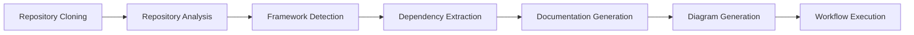
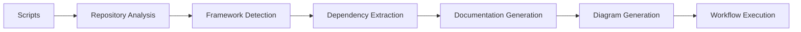
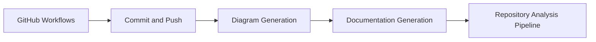
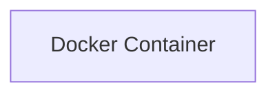

# AI GitHub Documentation Generator
=====================================

## Project Title
---------------

AI GitHub Documentation Generator is an AI-powered documentation orchestration system built with Kestra. The system automates the process of generating high-quality documentation for GitHub repositories, including README files, architecture documentation, and Mermaid diagrams.

## Project Description
--------------------

The AI GitHub Documentation Generator is designed to simplify the process of creating and maintaining documentation for GitHub repositories. The system uses natural language processing (NLP) and machine learning algorithms to analyze the repository code and generate accurate and up-to-date documentation. The system also integrates with GitHub webhooks to automate the process of updating documentation whenever changes are made to the repository.

## Features
------------

* GitHub webhook automation
* Repository analysis
* AI-generated README files
* Architecture documentation
* Mermaid diagram generation
* Automated Git commits
* Workflow orchestration using Kestra

## Tech Stack
-------------

* Kestra
* Python
* OpenAI API
* GitHub Webhooks
* Mermaid

## Architecture Overview
----------------------

The AI GitHub Documentation Generator consists of the following components:

* **Analyzer**: Responsible for analyzing the repository code and generating documentation.
* **Generator**: Responsible for generating README files, architecture documentation, and Mermaid diagrams.
* **Commiter**: Responsible for committing changes to the repository.
* **Orchestrator**: Responsible for orchestrating the workflow using Kestra.

### Mermaid Architecture Diagram
```mermaid
graph LR
    A[Analyzer] -->|analyzes|> B[Generator]
    B -->|generates|> C[Commiter]
    C -->|commits|> D[Repository]
    D -->|triggers|> A
```

## Installation Guide
--------------------

To install the AI GitHub Documentation Generator, follow these steps:

1. Clone the repository using `git clone https://github.com/username/repository.git`
2. Install the required dependencies using `pip install -r requirements.txt`
3. Configure the system by creating a `settings.yaml` file with the following contents:
```yml
github_token: your_github_token
openai_api_key: your_openai_api_key
```
4. Run the system using `python scripts/analyze_repo.py`

## Usage Instructions
---------------------

To use the AI GitHub Documentation Generator, follow these steps:

1. Create a new GitHub repository or select an existing one.
2. Configure the system by creating a `settings.yaml` file with the required settings.
3. Run the system using `python scripts/analyze_repo.py`.
4. The system will analyze the repository code and generate documentation.
5. Review and customize the generated documentation as needed.

## API Overview
----------------

The AI GitHub Documentation Generator provides the following APIs:

* **Analyzer API**: Provides endpoints for analyzing repository code and generating documentation.
* **Generator API**: Provides endpoints for generating README files, architecture documentation, and Mermaid diagrams.
* **Commiter API**: Provides endpoints for committing changes to the repository.

### API Endpoints
```markdown
### Analyzer API
* `POST /analyze`: Analyzes the repository code and generates documentation.
* `GET /documentation`: Returns the generated documentation.

### Generator API
* `POST /generate-readme`: Generates a README file.
* `POST /generate-architecture`: Generates architecture documentation.
* `POST /generate-mermaid`: Generates a Mermaid diagram.

### Commiter API
* `POST /commit`: Commits changes to the repository.
```

## Folder Structure
--------------------

The AI GitHub Documentation Generator has the following folder structure:
```markdown
* `analyzers`: Contains analyzer scripts
* `configs`: Contains configuration files
* `docs`: Contains documentation files
* `llm`: Contains large language model files
* `logs`: Contains log files
* `prompts`: Contains prompt files
* `scripts`: Contains script files
* `templates`: Contains template files
* `tests`: Contains test files
* `workflows`: Contains workflow files
```

## Deployment Instructions
-------------------------

To deploy the AI GitHub Documentation Generator, follow these steps:

1. Create a new GitHub repository or select an existing one.
2. Configure the system by creating a `settings.yaml` file with the required settings.
3. Run the system using `python scripts/analyze_repo.py`.
4. The system will analyze the repository code and generate documentation.
5. Review and customize the generated documentation as needed.
6. Deploy the system to a cloud platform or a containerization platform.

## Future Improvements
----------------------

The AI GitHub Documentation Generator is a continuously evolving system. Future improvements include:

* Integrating with more GitHub webhooks
* Supporting more programming languages
* Improving the accuracy of the generated documentation
* Adding more features to the system
* Improving the user interface and user experience

Note: This is a generated README file. Please review and customize it as needed to fit your specific use case.


# Architecture Documentation


### Repository Analysis
The provided repository architecture appears to be a Python-based application with a focus on repository analysis and documentation generation. The application utilizes various scripts and workflows to analyze repositories, generate documentation, and create diagrams.

### Application Flow
The application flow can be broken down into the following steps:
1. Repository cloning and analysis
2. Framework detection and dependency extraction
3. Documentation generation (API docs, README, architecture)
4. Diagram generation (Mermaid)
5. Workflow execution (commit and push, diagram generation, documentation generation)

### Backend/Frontend Structure
The repository does not appear to have a traditional frontend or backend structure. Instead, it consists of various scripts and workflows that perform specific tasks. The `scripts` directory contains Python scripts that handle tasks such as repository analysis, framework detection, and documentation generation.

### Services
The application utilizes the following services:
* OpenAI client (for language model interactions)
* GitHub workflows (for automating tasks)

### Deployment Flow
The deployment flow is managed through GitHub workflows. The `workflows` directory contains YAML files that define the deployment process, including:
* Commit and push
* Diagram generation
* Documentation generation
* Repository analysis pipeline

### Scaling Strategy
The scaling strategy for this application is not explicitly defined. However, since it utilizes GitHub workflows and Python scripts, it can be scaled horizontally by adding more workflow runs or vertically by increasing the resources allocated to the workflow runs.

### Mermaid Diagrams





### Conclusion
The repository architecture is designed to automate repository analysis and documentation generation tasks. It utilizes Python scripts and GitHub workflows to perform these tasks. While the application flow and services are well-defined, the scaling strategy is not explicitly stated. The provided Mermaid diagrams illustrate the application flow, script interactions, and workflow execution. 

To improve the repository architecture, consider adding a clear scaling strategy and implementing a more robust frontend/backend structure. Additionally, refining the workflow execution and script interactions can enhance the overall efficiency of the application. 

### Recommendations
* Implement a clear scaling strategy to ensure the application can handle increased traffic or large repository analysis tasks.
* Refine the workflow execution and script interactions to reduce dependencies and improve efficiency.
* Consider adding a traditional frontend/backend structure to improve the overall architecture and user experience.
* Utilize more advanced GitHub workflow features, such as conditional statements and parallel execution, to optimize the deployment flow. 

By addressing these areas, the repository architecture can be improved to provide a more efficient, scalable, and user-friendly application.


# Architecture Diagram


