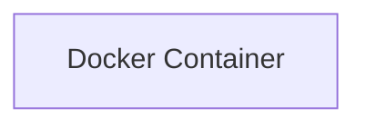

# AI GitHub Documentation Generator
=====================================

## Project Title
---------------

AI GitHub Documentation Generator is an AI-powered documentation orchestration system built with Kestra. The system automates the process of generating high-quality documentation for GitHub repositories, including README files, architecture documentation, and Mermaid diagrams.

## Project Description
--------------------

The AI GitHub Documentation Generator is designed to simplify the process of creating and maintaining documentation for GitHub repositories. The system uses natural language processing (NLP) and machine learning algorithms to analyze the repository code and generate accurate and up-to-date documentation. The system also integrates with GitHub webhooks to automate the process of updating documentation whenever changes are made to the repository.

## Features
------------

* GitHub webhook automation
* Repository analysis
* AI-generated README files
* Architecture documentation
* Mermaid diagram generation
* Automated Git commits
* Workflow orchestration using Kestra

## Tech Stack
-------------

* Kestra
* Python
* OpenAI API
* GitHub Webhooks
* Mermaid

## Architecture Overview
----------------------

The AI GitHub Documentation Generator consists of the following components:

* **Analyzer**: Responsible for analyzing the repository code and generating documentation.
* **Generator**: Responsible for generating README files, architecture documentation, and Mermaid diagrams.
* **Commiter**: Responsible for committing changes to the repository.
* **Orchestrator**: Responsible for orchestrating the workflow using Kestra.

### Mermaid Architecture Diagram
```mermaid
graph LR
    A[Analyzer] -->|analyzes|> B[Generator]
    B -->|generates|> C[Commiter]
    C -->|commits|> D[Repository]
    D -->|triggers|> A
```

## Installation Guide
--------------------

To install the AI GitHub Documentation Generator, follow these steps:

1. Clone the repository using `git clone https://github.com/username/repository.git`
2. Install the required dependencies using `pip install -r requirements.txt`
3. Configure the system by creating a `settings.yaml` file with the following contents:
```yml
github_token: your_github_token
openai_api_key: your_openai_api_key
```
4. Run the system using `python scripts/analyze_repo.py`

## Usage Instructions
---------------------

To use the AI GitHub Documentation Generator, follow these steps:

1. Create a new GitHub repository or select an existing one.
2. Configure the system by creating a `settings.yaml` file with the required settings.
3. Run the system using `python scripts/analyze_repo.py`.
4. The system will analyze the repository code and generate documentation.
5. Review and customize the generated documentation as needed.

## API Overview
----------------

The AI GitHub Documentation Generator provides the following APIs:

* **Analyzer API**: Provides endpoints for analyzing repository code and generating documentation.
* **Generator API**: Provides endpoints for generating README files, architecture documentation, and Mermaid diagrams.
* **Commiter API**: Provides endpoints for committing changes to the repository.

### API Endpoints
```markdown
### Analyzer API
* `POST /analyze`: Analyzes the repository code and generates documentation.
* `GET /documentation`: Returns the generated documentation.

### Generator API
* `POST /generate-readme`: Generates a README file.
* `POST /generate-architecture`: Generates architecture documentation.
* `POST /generate-mermaid`: Generates a Mermaid diagram.

### Commiter API
* `POST /commit`: Commits changes to the repository.
```

## Folder Structure
--------------------

The AI GitHub Documentation Generator has the following folder structure:
```markdown
* `analyzers`: Contains analyzer scripts
* `configs`: Contains configuration files
* `docs`: Contains documentation files
* `llm`: Contains large language model scripts
* `logs`: Contains log files
* `prompts`: Contains prompt files
* `scripts`: Contains script files
* `templates`: Contains template files
* `tests`: Contains test files
* `workflows`: Contains workflow files
```

## Deployment Instructions
-------------------------

To deploy the AI GitHub Documentation Generator, follow these steps:

1. Create a new GitHub repository or select an existing one.
2. Configure the system by creating a `settings.yaml` file with the required settings.
3. Run the system using `python scripts/analyze_repo.py`.
4. The system will analyze the repository code and generate documentation.
5. Review and customize the generated documentation as needed.
6. Deploy the system to a production environment using a containerization platform such as Docker.

## Future Improvements
----------------------

The AI GitHub Documentation Generator is a continuously evolving system, and there are several future improvements planned, including:

* Integrating with additional GitHub features, such as GitHub Actions and GitHub Pages.
* Supporting additional programming languages and frameworks.
* Improving the accuracy and quality of the generated documentation.
* Adding support for additional documentation formats, such as PDF and HTML.
* Integrating with other development tools and platforms, such as Jira and Slack.


# Architecture Documentation


### Repository Analysis
The provided repository architecture is a complex system with multiple components and services. The following sections will break down the application flow, backend/frontend structure, services, deployment flow, and scaling strategy.

### Application Flow
The application flow can be described as follows:
1. The system uses a set of analyzers (e.g., `docker_analyzer.py`, `express_analyzer.py`, `fastapi_analyzer.py`, etc.) to analyze repositories.
2. The analyzers are configured using settings from the `configs` directory (e.g., `prompt_config.yaml`, `settings.yaml`, `supported_frameworks.yaml`).
3. The system uses a language model (LLM) client (`openai_client.py`) to generate documentation and other content.
4. The system has a set of scripts (`scripts` directory) that perform various tasks, such as cloning repositories, detecting frameworks, extracting dependencies, and generating API documentation.
5. The system uses workflows (`workflows` directory) to automate tasks, such as committing and pushing changes, generating diagrams, and generating README files.

### Backend/Frontend Structure
The repository does not have a clear backend/frontend structure, as it appears to be a collection of scripts and services that perform specific tasks. However, the following components can be identified:
* **Backend**: The analyzers, LLM client, and scripts can be considered as part of the backend, as they perform the core functionality of the system.
* **Frontend**: There is no clear frontend component, as the system does not appear to have a user interface. However, the generated documentation and content can be considered as the output of the system.

### Services
The system has the following services:
* **Analyzer Service**: Provides analysis of repositories using various analyzers.
* **LLM Service**: Provides language model functionality for generating documentation and content.
* **Script Service**: Provides a set of scripts that perform various tasks, such as cloning repositories, detecting frameworks, and generating API documentation.
* **Workflow Service**: Provides automation of tasks using workflows.

### Deployment Flow
The deployment flow can be described as follows:
1. The system is deployed using Docker (as indicated by the presence of `docker-compose.yml` file).
2. The system uses GitHub workflows to automate tasks, such as committing and pushing changes, generating diagrams, and generating README files.

### Scaling Strategy
The scaling strategy for the system is not clear, as it depends on the specific requirements and constraints of the system. However, the following strategies can be considered:
* **Horizontal Scaling**: The system can be scaled horizontally by adding more instances of the analyzers, LLM client, and scripts.
* **Vertical Scaling**: The system can be scaled vertically by increasing the resources (e.g., CPU, memory) allocated to the instances.

### Mermaid Diagrams
```mermaid
graph LR
    A[Repository] -->|Clone|> B[Analyzer Service]
    B -->|Analyze|> C[LLM Service]
    C -->|Generate|> D[Documentation]
    D -->|Commit|> E[GitHub]
```

```mermaid
graph LR
    A[Script Service] -->|Detect|> B[Frameworks]
    B -->|Extract|> C[Dependencies]
    C -->|Generate|> D[API Documentation]
    D -->|Commit|> E[GitHub]
```

```mermaid
graph LR
    A[Workflow Service] -->|Commit|> B[GitHub]
    B -->|Push|> C[Repository]
    C -->|Trigger|> D[Workflow]
    D -->|Generate|> E[README]
```

Note: The Mermaid diagrams are simplified representations of the system and are not exhaustive. They are intended to provide a high-level overview of the system's components and interactions.


# Architecture Diagram


