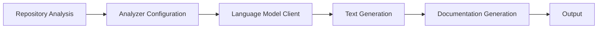
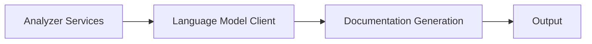
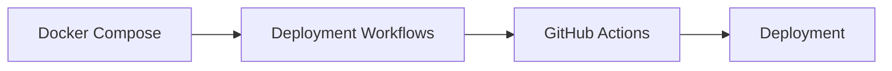
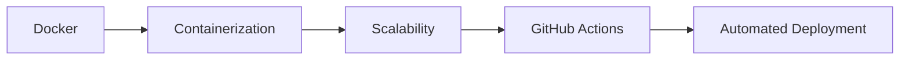
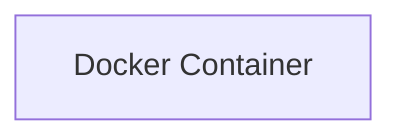

# AI GitHub Documentation Generator
=====================================

## Project Title
---------------

AI GitHub Documentation Generator is an AI-powered documentation orchestration system built with Kestra. The system automates the process of generating high-quality documentation for GitHub repositories, including README files, architecture documentation, and Mermaid diagrams.

## Project Description
--------------------

The AI GitHub Documentation Generator is designed to simplify the process of creating and maintaining documentation for GitHub repositories. The system uses natural language processing (NLP) and machine learning algorithms to analyze the repository code and generate accurate and up-to-date documentation. The system also integrates with GitHub webhooks to automate the process of updating documentation whenever changes are made to the repository.

## Features
------------

* GitHub webhook automation
* Repository analysis
* AI-generated README files
* Architecture documentation
* Mermaid diagram generation
* Automated Git commits
* Workflow orchestration using Kestra

## Tech Stack
-------------

* Kestra
* Python
* OpenAI API
* GitHub Webhooks
* Mermaid

## Architecture Overview
----------------------

The AI GitHub Documentation Generator consists of the following components:

* **Analyzer**: Responsible for analyzing the repository code and generating documentation.
* **Generator**: Responsible for generating README files, architecture documentation, and Mermaid diagrams.
* **Commiter**: Responsible for committing changes to the repository.
* **Orchestrator**: Responsible for orchestrating the workflow using Kestra.

### Mermaid Architecture Diagram
```mermaid
graph LR
    A[Analyzer] -->|analyzes|> B[Generator]
    B -->|generates|> C[Commiter]
    C -->|commits|> D[Repository]
    D -->|triggers|> A
```

## Installation Guide
--------------------

To install the AI GitHub Documentation Generator, follow these steps:

1. Clone the repository using `git clone https://github.com/username/repository.git`
2. Install the required dependencies using `pip install -r requirements.txt`
3. Configure the system by creating a `settings.yaml` file with the following contents:
```yml
github_token: your_github_token
openai_api_key: your_openai_api_key
```
4. Run the system using `python scripts/analyze_repo.py`

## Usage Instructions
---------------------

To use the AI GitHub Documentation Generator, follow these steps:

1. Create a new GitHub repository or select an existing one.
2. Configure the system by creating a `settings.yaml` file with the required settings.
3. Run the system using `python scripts/analyze_repo.py`.
4. The system will analyze the repository code and generate documentation.
5. Review and customize the generated documentation as needed.

## API Overview
----------------

The AI GitHub Documentation Generator provides the following APIs:

* **Analyzer API**: Provides endpoints for analyzing repository code and generating documentation.
* **Generator API**: Provides endpoints for generating README files, architecture documentation, and Mermaid diagrams.
* **Commiter API**: Provides endpoints for committing changes to the repository.

### API Endpoints
```markdown
### Analyzer API
* `POST /analyze`: Analyzes the repository code and generates documentation.
* `GET /documentation`: Returns the generated documentation.

### Generator API
* `POST /generate-readme`: Generates a README file.
* `POST /generate-architecture`: Generates architecture documentation.
* `POST /generate-mermaid`: Generates a Mermaid diagram.

### Commiter API
* `POST /commit`: Commits changes to the repository.
```

## Folder Structure
--------------------

The AI GitHub Documentation Generator has the following folder structure:
```markdown
* `analyzers`: Contains analyzer scripts.
* `configs`: Contains configuration files.
* `docs`: Contains documentation files.
* `llm`: Contains language model scripts.
* `logs`: Contains log files.
* `prompts`: Contains prompt files.
* `scripts`: Contains script files.
* `templates`: Contains template files.
* `tests`: Contains test files.
* `workflows`: Contains workflow files.
```

## Deployment Instructions
-------------------------

To deploy the AI GitHub Documentation Generator, follow these steps:

1. Create a new GitHub repository or select an existing one.
2. Configure the system by creating a `settings.yaml` file with the required settings.
3. Run the system using `python scripts/analyze_repo.py`.
4. The system will analyze the repository code and generate documentation.
5. Review and customize the generated documentation as needed.
6. Deploy the system to a production environment using a containerization platform such as Docker.

## Future Improvements
----------------------

The AI GitHub Documentation Generator has the following future improvements:

* **Improved Analyzer**: Improve the accuracy and efficiency of the analyzer.
* **Additional Generator**: Add additional generators for other types of documentation.
* **Enhanced Commiter**: Enhance the commiter to support multiple repository platforms.
* **Integration with Other Tools**: Integrate the system with other development tools and platforms.


# Architecture Documentation


### Repository Analysis
The provided repository architecture is a complex system with multiple components and services. Based on the file tree, we can infer the following:

#### Application Flow
The application flow can be described as follows:
1. The system uses a set of analyzers (e.g., `docker_analyzer.py`, `express_analyzer.py`, etc.) to analyze repositories.
2. The analyzers are configured using settings and prompt configurations stored in the `configs` directory.
3. The system uses a language model (LLM) client (`openai_client.py`) to generate text based on prompts.
4. The generated text is then used to create documentation (e.g., API docs, README, etc.) using templates stored in the `templates` directory.
5. The system also includes scripts for cloning repositories, detecting frameworks, extracting dependencies, and generating documentation.



#### Backend/Frontend Structure
The repository does not appear to have a traditional backend or frontend structure. Instead, it seems to be a collection of scripts and services that work together to analyze repositories and generate documentation.

#### Services
The system includes the following services:
* Analyzer services (e.g., `docker_analyzer.py`, `express_analyzer.py`, etc.)
* Language Model Client service (`openai_client.py`)
* Documentation generation service (using templates and scripts)



#### Deployment Flow
The deployment flow can be described as follows:
1. The system uses a `docker-compose.yml` file to define the services and their dependencies.
2. The `workflows` directory contains YAML files that define the deployment workflows (e.g., `commit_and_push.yaml`, `diagram_generation.yaml`, etc.).
3. The system uses GitHub Actions to automate the deployment process.



#### Scaling Strategy
The scaling strategy for this system is not explicitly defined. However, based on the use of Docker and GitHub Actions, it appears that the system is designed to be scalable and can be easily deployed to multiple environments.



### Conclusion
In conclusion, the provided repository architecture is a complex system with multiple components and services. The application flow, backend/frontend structure, services, deployment flow, and scaling strategy are all designed to work together to analyze repositories and generate documentation. The use of Docker, GitHub Actions, and language models makes the system scalable and efficient.


# Architecture Diagram


